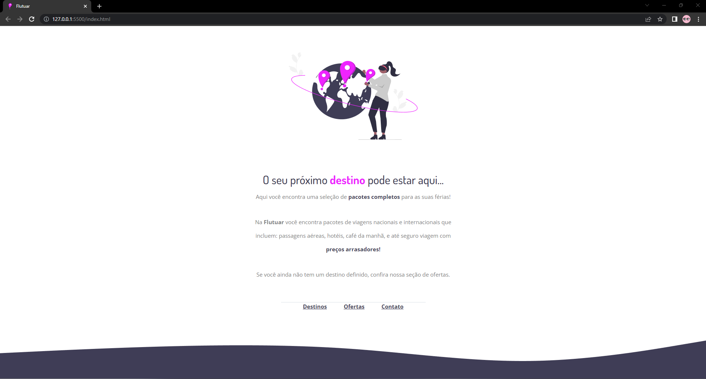

<h1 align="center"> Desafio Intermediário - Recriando layout </h1>

  <a href="#-tecnologias">Tecnologias</a>&nbsp;&nbsp;&nbsp;|&nbsp;&nbsp;&nbsp;
  <a href="#-projeto">Projeto</a>&nbsp;&nbsp;&nbsp;|&nbsp;&nbsp;&nbsp;
  <a href="#-layout">Layout</a>&nbsp;&nbsp;&nbsp;|&nbsp;&nbsp;&nbsp;
  <a href="#memo-licença">Licença</a>

 

  

## 🚀 Tecnologias

Esse projeto foi desenvolvido com as seguintes tecnologias:

- HTML e CSS
- Git e Github
- Figma

## 💻 Projeto

  Projeto foi recriado uma aplicação a partir de um layout pronto no figma, para fortalecer alguns conceitos aprendidos em aula na Rocketseat, entre eles:

  <ul align="center" type="none">
      <li>Estruturando um projeto HTML</li>
      <li>Uso de tags HTML mais comuns</li>
      <li>Conceitos iniciais de CSS</li>
      <li>Posicionamento e alinhamento de elementos na tela</li>
      <li>Aplicando fontes customizadas</li>
      <li>Espaçamentos.</li>
  </ul>

 

## 🔖 Layout

Você pode visualizar o layout do projeto através [DESSE LINK](https://www.figma.com/file/xw8p5pWZVO2BtX30Y4cdqn/Projeto01-Extra-(Copy)?t=YGQTsRfVTig0CtZa-0). É necessário ter conta no [Figma](https://figma.com) para acessá-lo.

## 📧 Contato

E-mail: victorvbprogramador@gmail.com

Linkedin: https://www.linkedin.com/in/victor-vinicius-9b0765263/

